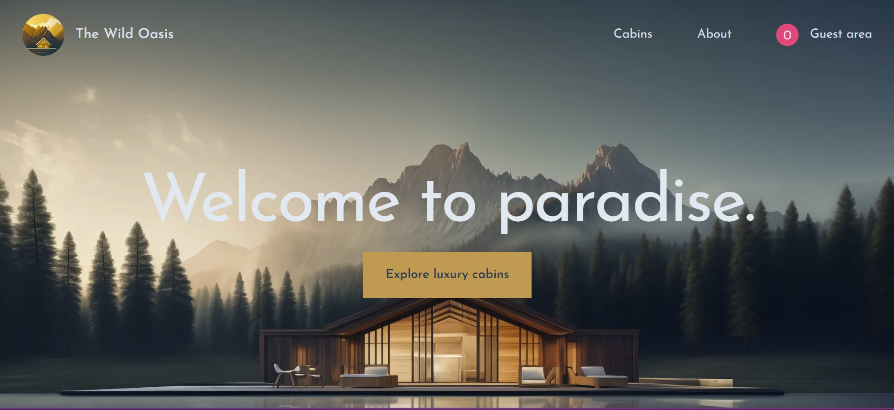
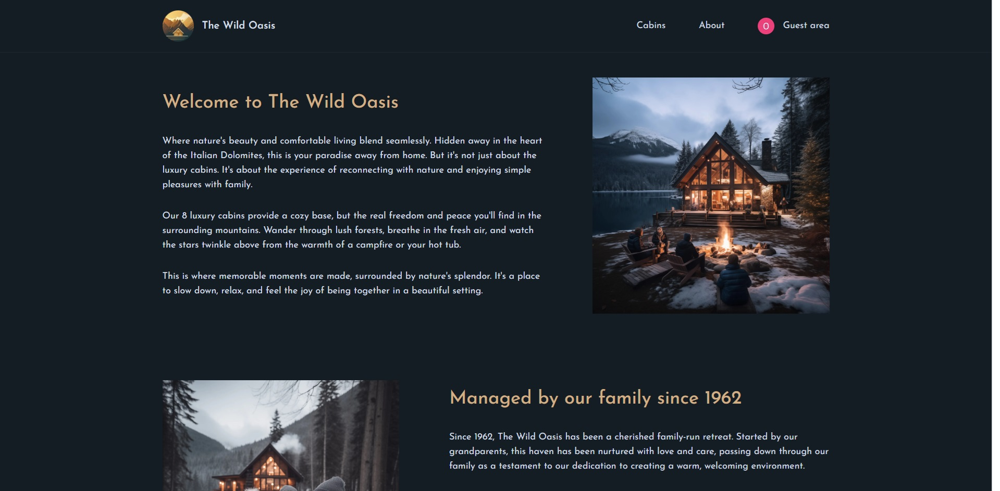
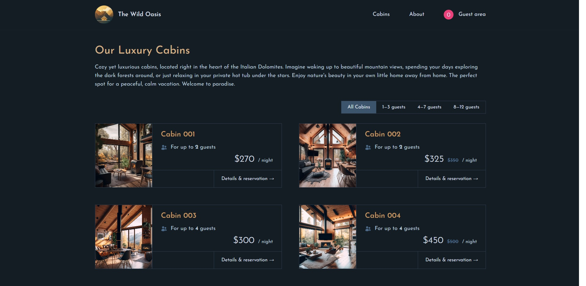
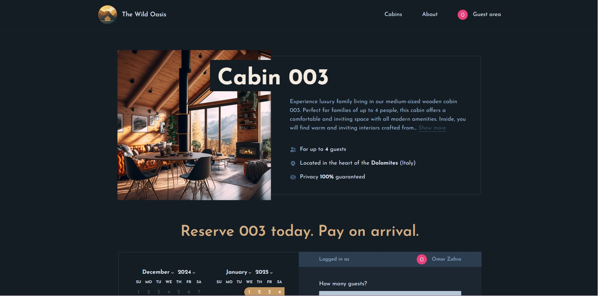
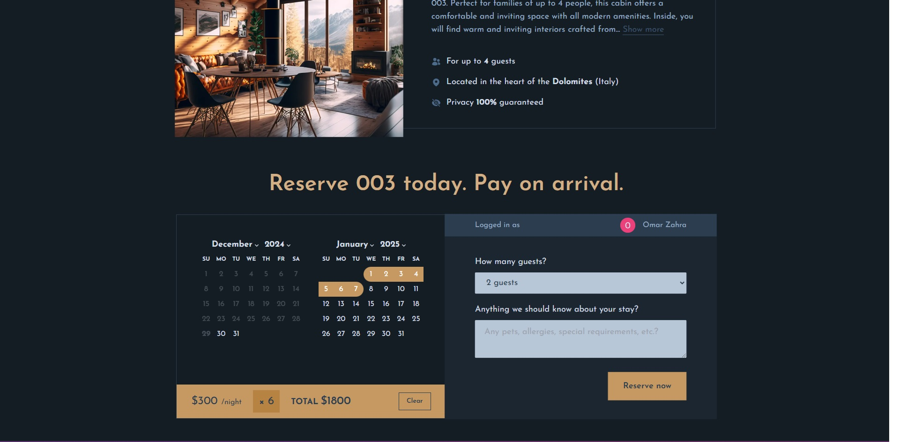
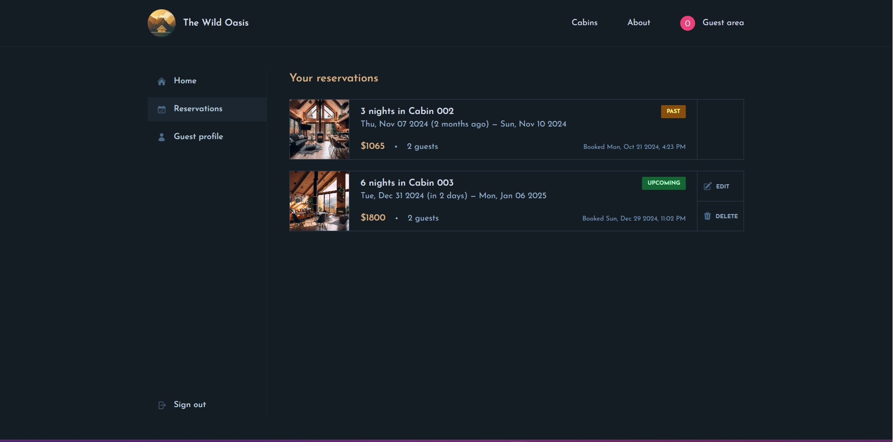

   
   
  

   The Wild Oasis is a hotel reservation platform connected to a management dashboard. Built with Next.js, TypeScript, Tailwind CSS, and Supabase, it enables users to browse available cabins, select their stay duration, and make reservations seamlessly. It also includes features for secure login and optimized performance.
  

 

## 💻 Technology Used

- **Next.js**: React framework for server-rendered and statically generated web applications.
- **TypeScript**: Strongly typed programming language that builds on JavaScript.
- **Tailwind CSS**: Utility-first CSS framework for rapid UI development.
- **Supabase**: Cloud database service for real-time and secure data storage.
- **Auth.js**: Library for secure and convenient Google OAuth login.

## Features

**User Authentication:**

- Google OAuth integration using Auth.js for secure and seamless login.

**Cabin Browsing and Reservation:**

- Users can explore available cabins.
- Select desired stay duration and book their stays effortlessly.

**User Profile Management:**

- Users can view all their reservations in one place.
- Options to edit or delete reservations.
- Edit profile details, such as name, email, or other information.

**Optimized Performance:**

- Leveraged Next.js features like Server-Side Rendering (SSR) and Static Site Generation (SSG) for improved performance and SEO.

**Responsive Design:**

- Fully responsive layout implemented with Tailwind CSS for an optimal experience on all devices.

## Screenshots

## Screenshots

 
 

 
 

 
 

 
 

 
 

 
